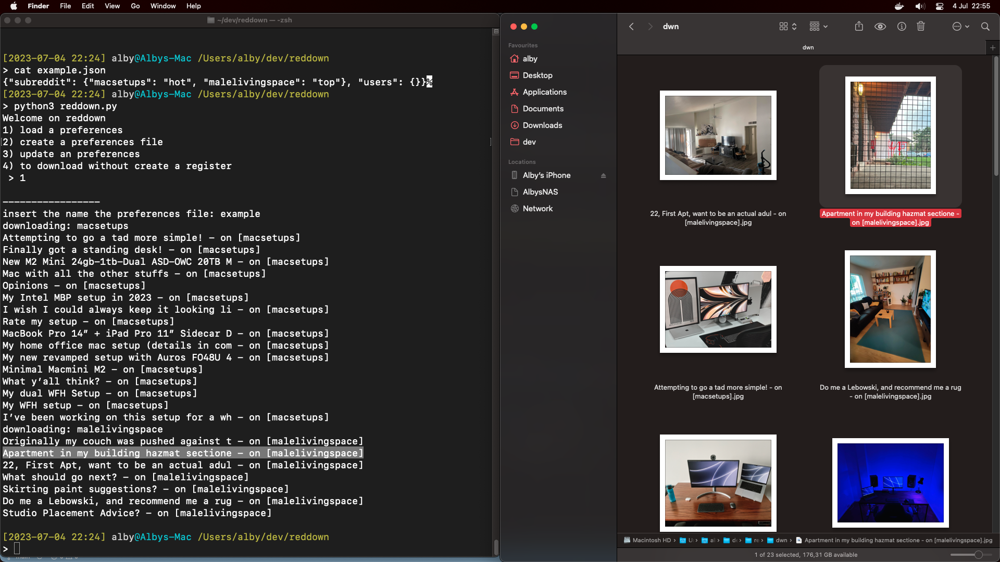

# A Reddit downloader

Reddown allows you to download images and gif from <a href="reddit.com">Reddit</a>, given a subreddit or user.

Works with:

- images (jpg,png,... dunno if Reddit has others extension)
- gif
- gifv (an <a href="imgur.com">Imgur</a> format, I've thought a workaround to retrieve the mp4 inside the page, not the best but it works)

> 🆓 **No Reddit account needed**

> 🔞 **Works with NSFW**

## IDEA

Simply download the data that reddit provide us with their JSON (hot.json/top.json/new.json)

For each subreddit/user you can pick the mode like "top" or "new", you can also create a preferences file to store the subs/users that you want to monitor/download.

### Example

## USAGE 

`$ python3 redDownIt.py`

## Dependencies:
- os
- sys
- json
- requests
- datetime as dt

- The file preferences have to be in the same folder of the program
- The data will be downloaded in the "./dwn/" folder

## TODO:
- [ ] make a GUI
- [X] create folder "dwn" if doesn't exists
- [X] import JSON prefereces
- [X] download video
- [ ] download album of images
- [ ] search user/subreddit
