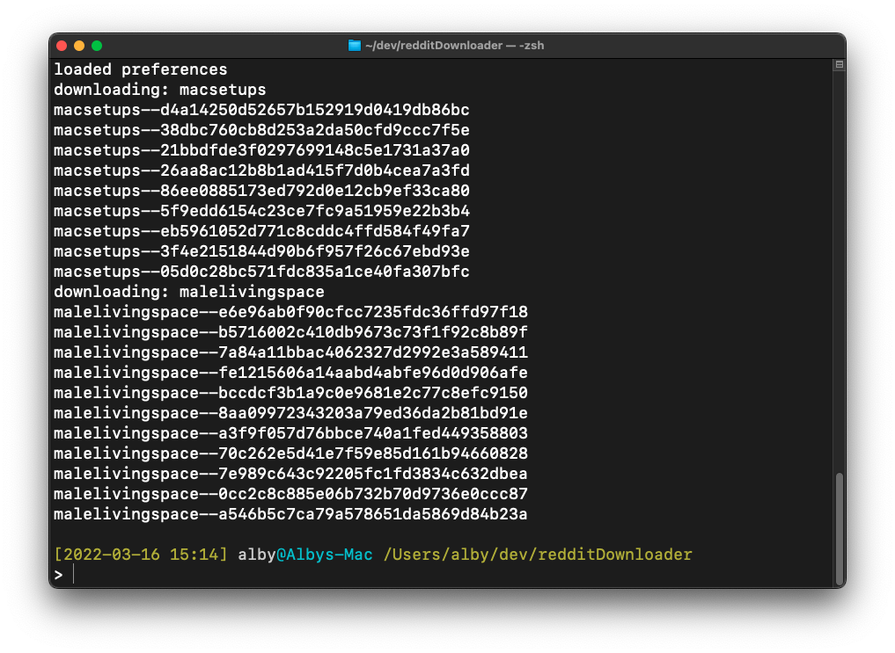
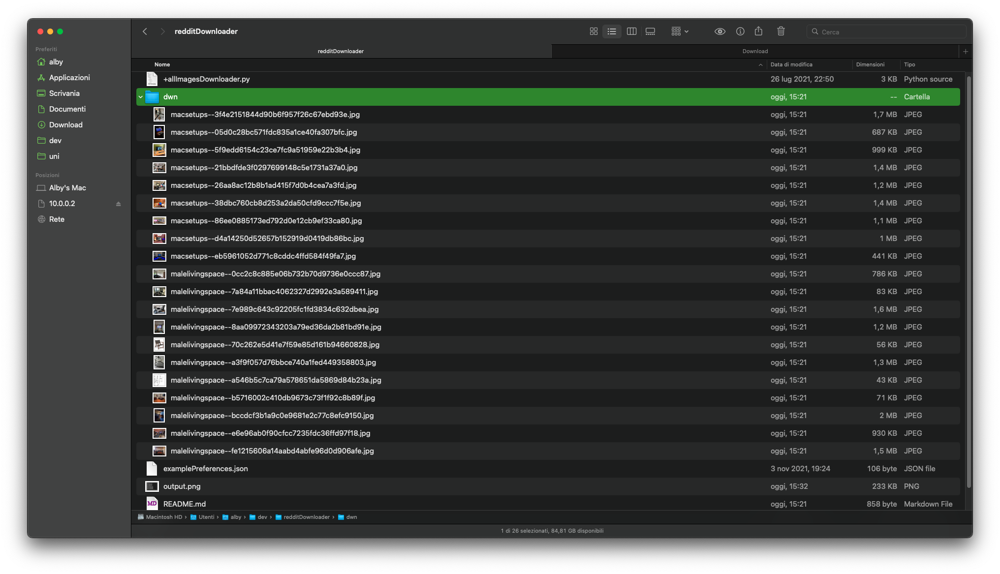

# A Reddit downloader

Reddown allows you to download images and (some) gif from <a hfref="reddit.com">Reddit</a>, given a subreddit or user.

## IDEA

Simply download the data that reddit provide us with their JSON (hot.json/top.json/new.json)

For each subreddit/user you can pick the mode like "top" or "new", you can also create a preferences file to store the subs/users that you want to monitor/download.

### Output

## USAGE 

**Don't need a reddit account or any API**

`$ python3 redDownIt.py`

## Dependencies:
- requests
- bs4
- os
- PIL (//pip3 install Pillow)
- hashlib

- The file preferences should be in the same folder of the program
- The data will be downloaded in the "./dwn/" folder

## TODO:
- [ ] make a GUI
- [X] create folder "dwn" if doesn't exists
- [X] import JSON prefereces
- [ ] download video
- [ ] download album of images
- [ ] search user/subreddit
